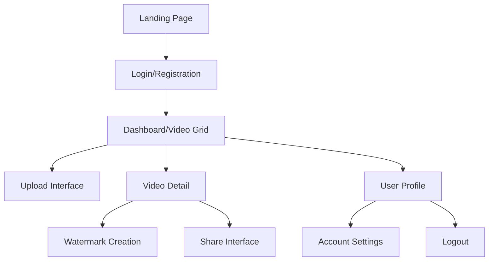
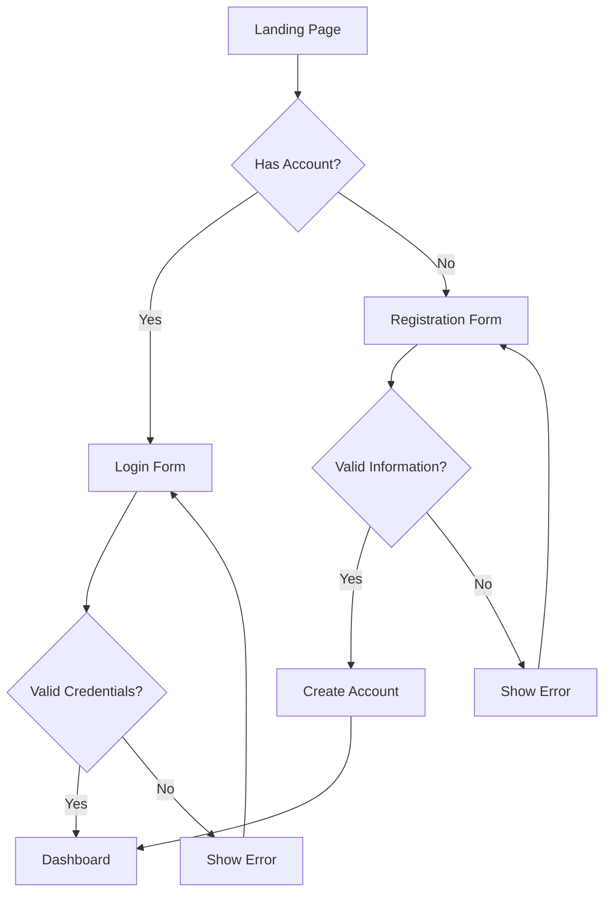
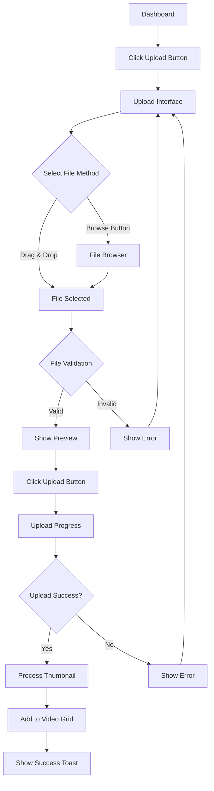
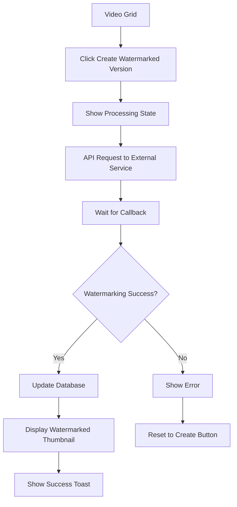
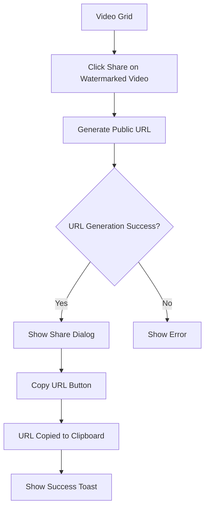
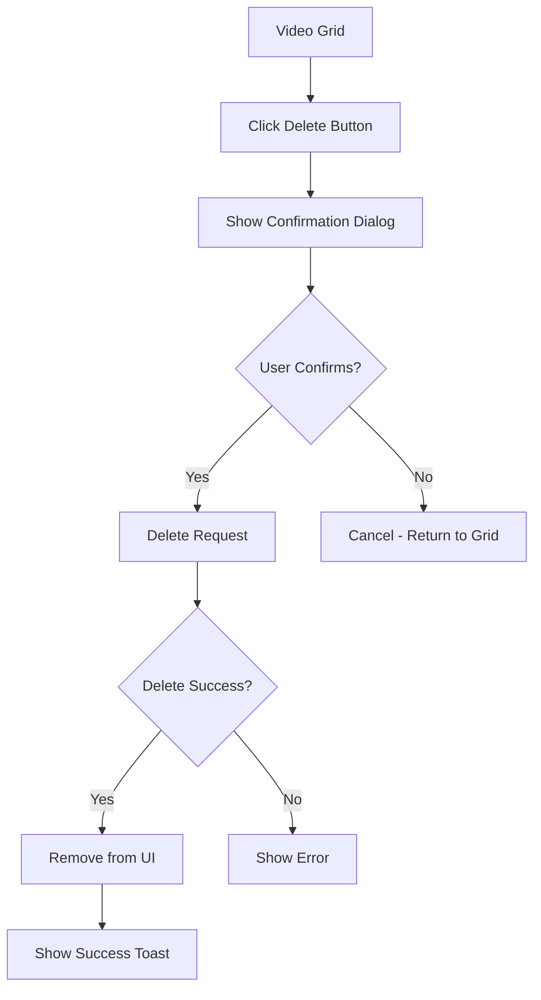

# SAVD App UI/UX Specification

This document defines the user experience goals, information architecture, user flows, and visual design specifications for SAVD App's user interface. It serves as the foundation for visual design and frontend development, ensuring a cohesive and user-centered experience.

## Introduction

The SAVD App is a video watermarking management platform designed to help content creators protect their intellectual property. The application provides a secure, user-friendly interface for uploading videos, creating watermarked versions, and sharing them with others. This specification outlines the user experience design, information architecture, interaction patterns, and visual design guidelines for the application.

### Overall UX Goals & Principles

#### Target User Personas

**Content Creator:** Individual creators who need to protect their video content before sharing with clients or publishing online. They are typically tech-savvy but not technical experts, and value simplicity and efficiency in their tools.

**Marketing Professional:** Team members who manage video assets for their organization and need to maintain brand control while sharing content internally and externally. They need to track which videos have been watermarked and shared.

**Small Business Owner:** Entrepreneurs who create and share video content as part of their business operations. They need a straightforward solution to protect their intellectual property without a steep learning curve.

#### Usability Goals

- **Ease of learning:** New users can complete the core upload-watermark-share workflow within 5 minutes of first use
- **Efficiency of use:** Returning users can upload and watermark videos in 3 steps or less
- **Error prevention:** Clear validation for file types/sizes and confirmation for destructive actions
- **Memorability:** Interface uses familiar patterns that require minimal relearning for returning users
- **User satisfaction:** Clean, modern interface that instills confidence in the security and professionalism of the service

#### Design Principles

1. **Clarity over complexity** - Prioritize clear, straightforward interactions over feature density
2. **Visual feedback at every step** - Provide clear status indicators for all asynchronous processes
3. **Content-focused experience** - Make the videos the hero of the interface with minimal UI distraction
4. **Guided workflows** - Lead users through complex processes with clear next steps
5. **Accessibility by default** - Design for all users regardless of abilities or devices

### Change Log

| Date | Version | Description | Author |
|------|---------|-------------|--------|
| 2025-09-20 | 1.0 | Initial specification | UX Expert |

## Information Architecture (IA)

### Site Map / Screen Inventory

### Navigation Structure

**Primary Navigation:** The application uses a simple top navigation bar with the SAVD App logo on the left (which links to the dashboard) and user profile dropdown on the right. The primary navigation is minimal to focus on content.

**Secondary Navigation:** Within the dashboard, a secondary action bar provides access to the upload function and potential filtering/sorting options for the video grid.

**Breadcrumb Strategy:** Breadcrumbs will be used only for deeper navigation paths (e.g., Dashboard > Video Detail) to help users understand their location and provide quick navigation back to parent screens.

## User Flows

### User Authentication Flow

**User Goal:** Register for a new account or log in to an existing account

**Entry Points:** Landing page, direct URL

**Success Criteria:** User is authenticated and redirected to the dashboard

#### Flow Diagram

#### Edge Cases & Error Handling:
- Invalid email format shows inline validation error
- Incorrect password shows error message
- Account already exists during registration
- Password reset flow for forgotten passwords

**Notes:** Authentication leverages Supabase Auth with email/password. Future enhancements could include social login options.

### Video Upload Flow

**User Goal:** Upload a new video to the system

**Entry Points:** Dashboard upload button

**Success Criteria:** Video is uploaded to Wasabi storage and appears in the user's video grid

#### Flow Diagram

#### Edge Cases & Error Handling:
- File too large (>500MB) shows error before upload attempts
- Unsupported file format validation
- Network interruption during upload
- Duplicate filename handling

**Notes:** Upload uses pre-signed URLs to Wasabi storage. Progress indicator shows percentage complete during upload.

### Watermark Creation Flow

**User Goal:** Create a watermarked version of an uploaded video

**Entry Points:** "Create Watermarked Version" button on video card in grid view

**Success Criteria:** Watermarked version is created and displayed alongside the original video

#### Flow Diagram

#### Edge Cases & Error Handling:
- External service timeout or failure
- Callback never received (timeout handling)
- Video format incompatible with watermarking service

**Notes:** The watermarking process is asynchronous. Users should be able to continue using the application while watermarking is in progress.

### Video Sharing Flow

**User Goal:** Generate and share a public URL for a watermarked video

**Entry Points:** Share button on watermarked video card

**Success Criteria:** Public URL is generated and available for the user to copy

#### Flow Diagram

#### Edge Cases & Error Handling:
- URL generation failure
- Copy to clipboard failure (fallback to manual selection)
- Previously shared video (show existing URL)

**Notes:** Only watermarked videos can be shared. Original videos do not have share buttons.

### Video Deletion Flow

**User Goal:** Delete an original video or its watermarked version

**Entry Points:** Delete button on video card (original or watermarked)

**Success Criteria:** Selected video is removed from storage and database, and no longer appears in the grid

#### Flow Diagram

#### Edge Cases & Error Handling:
- Deletion of original video with existing watermarked version (cascade delete option)
- Failed deletion due to permission issues
- Network interruption during deletion request

**Notes:** Deleting an original video should prompt the user about whether to also delete any associated watermarked versions.

## Wireframes & Mockups

**Primary Design Files:** Figma will be used for detailed visual designs and interactive prototypes. The Figma project link will be shared here once created.

### Key Screen Layouts

#### Dashboard / Video Grid

**Purpose:** Main interface where users view and manage all their videos

**Key Elements:**
- Header with logo, navigation, and user profile
- Upload button prominently placed in the action bar
- Grid layout with video cards arranged in rows
- Each original video paired with its watermarked version (or placeholder)
- Status indicators for in-progress operations
- Responsive grid that adapts to different screen sizes

**Interaction Notes:** Videos are displayed in a grid with 3-4 pairs per row on desktop, scaling down to 1-2 pairs on mobile. Each video card has action buttons (watermark, share, delete) that appear on hover/focus.

#### Upload Interface

**Purpose:** Allow users to easily upload new videos to the system

**Key Elements:**
- Drag and drop area with clear visual cues
- File browser button alternative
- File type and size restrictions clearly stated
- Preview of selected file before upload
- Progress indicator during upload
- Success/error feedback

**Interaction Notes:** The upload interface can be a modal overlay or a dedicated page. It should provide clear feedback throughout the upload process and gracefully handle errors.

#### Video Card Component

**Purpose:** Display individual videos with their thumbnails and available actions

**Key Elements:**
- Video thumbnail (16:9 aspect ratio)
- Video title/filename
- Action buttons appropriate to video state
- Status indicator for processing states
- Visual distinction between original and watermarked versions

**Interaction Notes:** Original and watermarked videos are visually paired but have different available actions. Original videos have watermark/delete actions, while watermarked videos have share/delete actions.

#### Share Dialog

**Purpose:** Generate and provide public URL for watermarked videos

**Key Elements:**
- Generated public URL in a text field
- Copy to clipboard button
- Optional sharing options (email, social)
- Close button
- Success confirmation for copy action

**Interaction Notes:** The dialog appears as a modal overlay when the share button is clicked on a watermarked video. The URL should be automatically selected for easy copying.

## Component Library / Design System

**Design System Approach:** The SAVD App will use Shadcn UI as the foundation for its component library. Shadcn UI provides a set of accessible, customizable components built on Radix UI primitives and styled with Tailwind CSS. This approach allows for rapid development while maintaining a consistent, professional look and feel.

### Core Components

#### Video Card

**Purpose:** Display video thumbnails with associated metadata and action buttons

**Variants:** 
- Original video card
- Watermarked video card
- Processing state card
- Empty state card (placeholder for watermarked version)

**States:** 
- Default
- Hover/Focus
- Selected
- Disabled
- Error
- Processing

**Usage Guidelines:** Video cards should always be displayed in pairs (original + watermarked) within the grid layout. Cards should maintain a consistent 16:9 aspect ratio for thumbnails. Action buttons should only appear on hover/focus to reduce visual clutter.

#### Button

**Purpose:** Provide interactive controls for user actions

**Variants:**
- Primary (high emphasis actions like Upload, Watermark)
- Secondary (medium emphasis actions like Share)
- Destructive (dangerous actions like Delete)
- Ghost (low emphasis actions)
- Icon (compact button with only an icon)

**States:**
- Default
- Hover
- Active
- Focused
- Disabled
- Loading

**Usage Guidelines:** Use primary buttons sparingly for the most important actions. Use destructive buttons with confirmation dialogs. Icon buttons should always include tooltips for accessibility.

#### Upload Zone

**Purpose:** Provide an area for users to drag and drop or select files

**Variants:**
- Empty
- Drag active
- File selected
- Uploading
- Error
- Success

**States:**
- Default
- Drag over
- Invalid file
- Upload progress
- Upload complete
- Upload error

**Usage Guidelines:** The upload zone should provide clear visual feedback for all states of the upload process. It should include both drag-and-drop functionality and a traditional file browser button.

#### Toast Notification

**Purpose:** Provide non-intrusive feedback about the results of user actions

**Variants:**
- Success
- Error
- Warning
- Info

**States:**
- Appearing
- Visible
- Dismissing

**Usage Guidelines:** Toasts should appear in a consistent location (typically top-right) and automatically dismiss after a reasonable timeout. They should be dismissible by the user and should not stack excessively.

## Branding & Style Guide

**Brand Guidelines:** The SAVD App will follow a clean, professional aesthetic that emphasizes content while maintaining a modern, trustworthy appearance.

### Color Palette

| Color Type | Hex Code | Usage |
|------------|----------|-------|
| Primary | `#0070F3` | Primary buttons, active states, links |
| Secondary | `#7928CA` | Accent elements, secondary buttons, highlights |
| Accent | `#FF4D4F` | Attention-grabbing elements, notifications |
| Success | `#52C41A` | Positive feedback, confirmations, completed states |
| Warning | `#FAAD14` | Cautions, important notices, in-progress states |
| Error | `#F5222D` | Errors, destructive actions, critical alerts |
| Neutral | `#1F2937`, `#4B5563`, `#9CA3AF`, `#E5E7EB`, `#F9FAFB` | Text, borders, backgrounds, cards |

### Typography

#### Font Families

- **Primary:** Geist Sans (UI text, buttons, labels)
- **Secondary:** Geist Sans (headings, emphasis)
- **Monospace:** Geist Mono (code, technical information)

#### Type Scale

| Element | Size | Weight | Line Height |
|---------|------|--------|------------|
| H1 | 2rem (32px) | 700 | 1.2 |
| H2 | 1.5rem (24px) | 700 | 1.3 |
| H3 | 1.25rem (20px) | 600 | 1.4 |
| Body | 1rem (16px) | 400 | 1.5 |
| Small | 0.875rem (14px) | 400 | 1.5 |

### Iconography

**Icon Library:** Lucide Icons will be used as the primary icon set for consistency and simplicity. These icons work well with Shadcn UI and provide a clean, modern aesthetic.

**Usage Guidelines:** Icons should be used consistently throughout the application to represent the same actions or concepts. All icons should have appropriate text labels or tooltips for accessibility. Icon sizes should be standardized (16px for inline, 20px for buttons, 24px for feature icons).

### Spacing & Layout

**Grid System:** The application will use a 12-column grid system for layout, implemented through Tailwind CSS's grid utilities.

**Spacing Scale:** Following Tailwind's spacing scale:
- 0.25rem (4px) - Extra small spacing (xs)
- 0.5rem (8px) - Small spacing (sm)
- 1rem (16px) - Medium spacing (md)
- 1.5rem (24px) - Large spacing (lg)
- 2rem (32px) - Extra large spacing (xl)
- 3rem (48px) - 2xl spacing
- 4rem (64px) - 3xl spacing

## Accessibility Requirements

### Compliance Target

**Standard:** WCAG 2.1 Level AA

### Key Requirements

**Visual:**
- Color contrast ratios: Minimum 4.5:1 for normal text and 3:1 for large text and UI components
- Focus indicators: Visible focus states for all interactive elements with minimum 3:1 contrast ratio
- Text sizing: Support for 200% text zoom without loss of content or functionality

**Interaction:**
- Keyboard navigation: All functionality must be accessible via keyboard alone, with logical tab order
- Screen reader support: All content and functionality must be accessible to screen readers using ARIA attributes when necessary
- Touch targets: Minimum size of 44x44 pixels for all interactive elements on touch devices

**Content:**
- Alternative text: All images, including video thumbnails, must have descriptive alt text
- Heading structure: Proper semantic heading hierarchy (H1-H6) throughout the application
- Form labels: All form inputs must have associated labels and clear error messages

### Testing Strategy

Accessibility testing will be conducted throughout the development process using a combination of automated and manual methods:

1. **Automated testing:** Use tools like Axe, Lighthouse, and WAVE to identify common accessibility issues
2. **Manual testing:** Conduct keyboard navigation testing, screen reader testing (using NVDA and VoiceOver), and color contrast verification
3. **User testing:** Include users with disabilities in usability testing sessions
4. **Regular audits:** Conduct quarterly accessibility audits to ensure ongoing compliance

## Responsiveness Strategy

### Breakpoints

| Breakpoint | Min Width | Max Width | Target Devices |
|------------|-----------|-----------|----------------|
| Mobile | 320px | 639px | Smartphones in portrait mode |
| Tablet | 640px | 1023px | Tablets, smartphones in landscape |
| Desktop | 1024px | 1279px | Laptops, small desktop monitors |
| Wide | 1280px | - | Large desktop monitors, TVs |

### Adaptation Patterns

**Layout Changes:** 
- Mobile: Single column layout with stacked content
- Tablet: Two column grid for video pairs
- Desktop: Three or four column grid for video pairs
- Wide: Four column grid with additional whitespace

**Navigation Changes:**
- Mobile: Hamburger menu for secondary navigation items
- Tablet and above: Full horizontal navigation bar
- Mobile: Bottom action bar for frequently used actions
- Desktop: Right-aligned action buttons in header

**Content Priority:**
- Mobile: Focus on core functionality (upload, watermark, share)
- Tablet: Add secondary information (upload date, file size)
- Desktop: Show all metadata and extended options

**Interaction Changes:**
- Mobile: Touch-optimized controls with larger tap targets
- Desktop: Hover states and keyboard shortcuts
- Mobile: Swipe gestures for some actions
- Desktop: Drag and drop functionality

## Animation & Micro-interactions

### Motion Principles

Animations in the SAVD App should follow these core principles:

1. **Purposeful:** Every animation should serve a functional purpose, such as providing feedback or guiding attention
2. **Subtle:** Animations should be understated and professional, not flashy or distracting
3. **Consistent:** Similar actions should have similar animations throughout the application
4. **Efficient:** Animations should be quick and not delay user interaction (generally 200-300ms)
5. **Optional:** All animations should respect user preferences for reduced motion

### Key Animations

- **Page Transitions:** Subtle fade transitions between major views (Duration: 200ms, Easing: ease-in-out)

- **Card Hover:** Slight elevation effect on video cards when hovered (Duration: 150ms, Easing: ease-out)

- **Button States:** Smooth transitions between button states including hover, active, and disabled (Duration: 100ms, Easing: ease)

- **Toast Notifications:** Slide-in and fade for toast notifications (Duration: 300ms, Easing: cubic-bezier(0.16, 1, 0.3, 1))

- **Upload Progress:** Smooth progress bar animation with subtle pulse at completion (Duration: varies with upload, Easing: linear)

- **Loading States:** Subtle pulse or spinner animations for asynchronous operations (Duration: infinite loop, Easing: ease-in-out)

- **Dropdown Menus:** Fade and slight scale animation for dropdown menus (Duration: 150ms, Easing: ease-out)

- **Error Shake:** Gentle horizontal shake animation for validation errors (Duration: 400ms, Easing: cubic-bezier(0.36, 0.07, 0.19, 0.97))

## Performance Considerations

### Performance Goals

- **Page Load:** Initial page load under 2 seconds on 4G connections
- **Interaction Response:** UI responses to user interactions within 100ms
- **Animation FPS:** Maintain 60fps for all animations on modern devices

### Design Strategies

1. **Image Optimization:**
   - Use responsive images with appropriate sizes for different viewports
   - Implement lazy loading for video thumbnails
   - Use modern image formats (WebP with fallbacks)
   - Apply appropriate compression to thumbnails

2. **Component Loading:**
   - Implement code splitting for different application routes
   - Use skeleton loaders for content that requires API calls
   - Prioritize loading critical UI elements first

3. **Video Handling:**
   - Generate and display low-resolution thumbnails
   - Defer video metadata loading until needed
   - Implement pagination for large video libraries
   - Use virtualized lists for smooth scrolling with many videos

4. **API Optimization:**
   - Implement request batching where appropriate
   - Cache frequently accessed data
   - Use optimistic UI updates for better perceived performance
   - Implement debouncing for search and filter operations

5. **Resource Management:**
   - Minimize third-party dependencies
   - Implement proper bundle splitting and tree shaking
   - Use web workers for intensive operations
   - Monitor and optimize memory usage, especially for video handling

## Next Steps

### Immediate Actions

1. Review this UI/UX specification with stakeholders to gather feedback and make necessary adjustments
2. Create detailed wireframes and mockups in Figma based on this specification
3. Develop a component library in Storybook to validate the design system
4. Create interactive prototypes for key user flows to validate the user experience
5. Conduct usability testing with representative users to identify potential improvements

### Design Handoff Checklist

- [ ] All user flows documented
- [ ] Component inventory complete
- [ ] Accessibility requirements defined
- [ ] Responsive strategy clear
- [ ] Brand guidelines incorporated
- [ ] Performance goals established
- [ ] Figma design file created and organized
- [ ] Interactive prototype developed
- [ ] Design tokens exported for development
- [ ] Component specifications documented

## Checklist Results

This UI/UX specification has been created in accordance with the requirements outlined in the PRD and project brief. It provides a comprehensive guide for the design and development of the SAVD App's user interface, focusing on creating an intuitive, accessible, and efficient experience for managing video watermarking.
