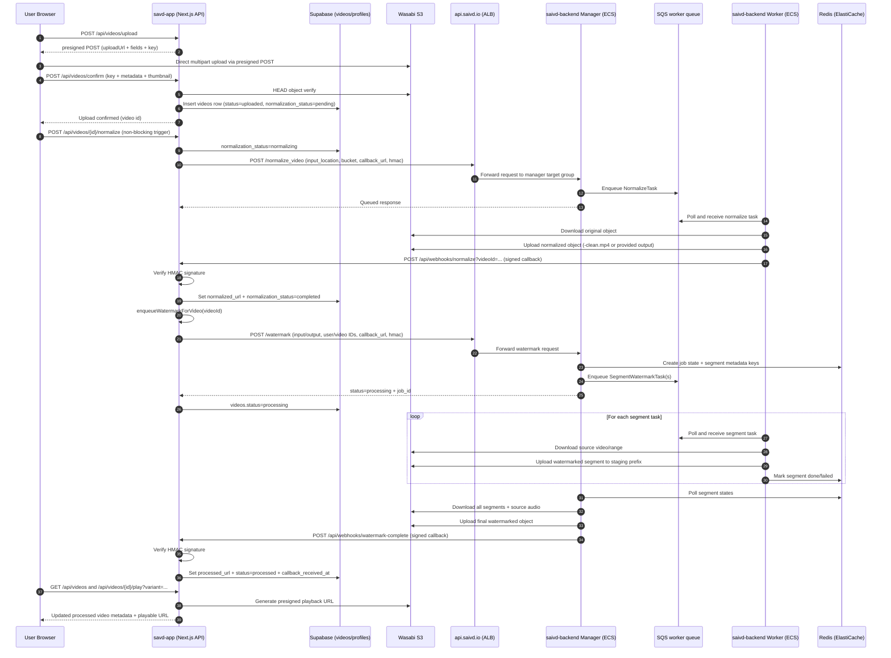

# Upload, Normalize, and Watermark Workflow (Production)

This document describes the current end-to-end production workflow across:

- `savd-app` (frontend + app APIs + webhook handlers)
- `saivd-backend` (manager/worker services for normalize and watermark processing)
- `saivd-infra` production Terraform (ALB, ECS, SQS, Redis, autoscaling, secrets)

**Local E2E with manager callbacks (ngrok):** To run `savd-app` locally with public webhook URLs, use `npm run dev:callbacks` and the steps in [AGENTS.md](../AGENTS.md#local-development-callbacks-via-ngrok).

## Mermaid Sequence Diagram

## End-to-End Flow Details

### 1) Upload in `savd-app`

1. Client hook `useVideoUpload` calls:
   - `POST /api/videos/upload` for presigned fields.
   - Browser direct upload to Wasabi.
   - `POST /api/videos/confirm` to persist metadata.
2. Confirm route validates object existence in Wasabi.
3. App inserts `videos` row with:
   - `original_url` (object key)
   - `status = "uploaded"`
   - `normalization_status = "pending"`
   - optional thumbnail data.
4. Client triggers `POST /api/videos/{id}/normalize` asynchronously.

### 2) Normalize request and callback

1. `POST /api/videos/{id}/normalize` verifies ownership and sets DB state to `normalizing`.
2. App calls backend manager `POST /normalize_video` through `WATERMARK_API_URL`/`WATERMARK_SERVICE_URL`.
3. Manager enqueues a `NormalizeTask` to worker queue (SQS in production).
4. Worker:
   - Downloads source object from Wasabi.
   - Normalizes/transcodes to canonical MP4.
   - Uploads normalized output.
   - Sends signed callback to `savd-app` normalize webhook.
5. App webhook validates HMAC and updates:
   - `normalized_url`
   - `normalization_status` and message fields.

### 3) Watermark enqueue and distributed processing

1. After normalize success, app calls `enqueueWatermarkForVideo(videoId)`.
2. App chooses watermark input key:
   - `normalized_url` if present, else `original_url`.
3. App computes watermark output key (`-watermarked` suffix) and calls manager `POST /watermark`.
4. Manager creates job state in Redis and enqueues segment tasks.
5. Worker fleet consumes segment tasks from SQS, processes each segment, writes staging objects, and marks status in Redis.
6. Manager waits for segment completion, finalizes (concat/mux), and uploads final watermarked object.
7. Manager sends signed callback to `POST /api/webhooks/watermark-complete`.
8. App webhook validates HMAC and sets:
   - `processed_url`
   - `status = "processed"`
   - `callback_received_at`.

### 4) Playback and status visibility

- UI refreshes via `GET /api/videos`.
- Playback uses `GET /api/videos/{id}/play` with variants:
  - `upload` -> `original_url`
  - default/original -> `normalized_url ?? original_url`
  - `watermarked` -> `processed_url`
- Play route signs a temporary Wasabi URL before returning to client.

## Components and Responsibilities

### `savd-app`

- Upload orchestration in browser + app APIs.
- Database ownership checks and metadata lifecycle.
- Normalize + watermark webhook verification with HMAC.
- Automatic watermark enqueue after normalize success.
- Queue status polling passthrough for UI progress states.

### `saivd-backend`

- Manager API endpoints:
  - `/normalize_video`
  - `/watermark`
  - `/queue_status/{user_id}`
  - `/clear_queue`
- Queue producer for normalize and watermark segment tasks.
- Worker execution for normalization and segment watermarking.
- Distributed coordination via Redis and final output assembly.
- Signed webhook callbacks back to `savd-app`.

### Production `saivd-infra`

- ALB TLS ingress for manager endpoints.
- ECS manager service and ECS worker service.
- SQS worker queue + DLQ.
- ElastiCache Redis for distributed state.
- Scheduled backlog metrics and ECS autoscaling.
- Secrets Manager injection (Wasabi creds, Redis auth token).

## Production Data and Control Plane Wiring

- **Ingress:** `api.saivd.io` -> ALB -> manager target group.
- **Async transport:** Manager -> SQS -> Worker.
- **Distributed state:** Manager/Worker <-> Redis.
- **Media storage:** Worker/Manager <-> Wasabi S3-compatible bucket.
- **App state:** `savd-app` <-> Supabase.
- **Completion signals:** Backend -> signed webhooks -> `savd-app`.

## Key Environment/Config Inputs

- `savd-app`:
  - `WATERMARK_API_URL` / `WATERMARK_SERVICE_URL`
  - `NORMALIZE_CALLBACK_HMAC_SECRET`
  - `WATERMARK_CALLBACK_HMAC_SECRET`
  - `NEXT_PUBLIC_APP_URL`
  - Wasabi + Supabase credentials
- `saivd-backend` manager/worker:
  - `WORKER_SQS_QUEUE_URL`
  - `REDIS_*`, `REQUIRE_REDIS`
  - `WATERMARK_STAGING_PREFIX`
  - segment sizing knobs (`WATERMARK_SEGMENT_FRAMES`, min/max segments)
  - Wasabi credentials and endpoint
- `saivd-infra`:
  - ECS task env/secrets wiring in production Terraform
  - ALB target group defaults to manager service
  - SQS autoscaling and DLQ settings

## Operational Notes

- Upload and normalize trigger are client-visible, but normalize/watermark execution is asynchronous.
- Callback failures can cause delayed UI completion even when media processing succeeded; monitor webhook delivery logs.
- Worker scaling is queue-depth driven; saturation typically appears as backlog growth in SQS and delayed callback arrival.
